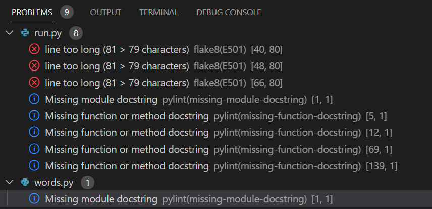

# Classic Hangman
Hangman is a Python terminal game, which runs in the Code Institue mock terminal on Heroku.

Players try to guess the letters of the hidden word before they ran out of lives.

---

## How to play

Classic hangman is very intuitive and fun game. In this game user will easily start a game by just typing first letter. If user guesses a letter thats in the word it will display in terminal on the line, if user doesn't guess a word terminal will show a head of hangman as a first sign of wrong letter guessing. At the end of the game user can choose to play again or not.

---

## UX User Experience

**User Goals**
* As a user i want to have fun with game.
* As a user i want the game to be challenging.

**User Stories**

**As a user, I want the game to be intuitive.**
* The user should be able to understand easy game steps by just typing guessing letters.

**As a user, I want to quickly start the game.**
* The user should be able to see message "Guess ahidden letter or word:" and easily start the game.

**As a user, I would like to be able to choose if i want to play a new game or not.**
* The user should be able to see at the end of game option Play Again? (Y/N).

**Project Goal**

* The main goal of this project is to make minimum design game that will be easy, simple and quick to play for all age groups.
---

## Features

**Existing features**

* Welcome screen
* Accept user inputs

* Shows when user didn't guess letter

* Shows when user already guessed same letter

* Game shows to user new parts of hangman each time user doesn't guess a letter

* In case the user lost, game will show actual hidden word, wish user "Good luck next time and it will offer user with option to play game again

---

**Future Features**

* Different levels of difficulty
* Add scoring system
* Add option for player name input

---

## Technologies Used

**Languages used**
* [Python](https://en.wikipedia.org/wiki/Python_(programming_language))

**Programs used**
* [GitHub](https://github.com/) Github was used to store the project.
* [GitPod](https://www.gitpod.io/) GitPod was used for writing code.
* [Heroku](https://www.heroku.com/) Heroku was used to deploy project.
* [PEP8online](http://pep8online.com/) PEP8online Validator was used to check for errors in code.

**Libraries**
* random was used to select a random word.

---
## Testing

* Code has been tested through [PEP8](http://pep8online.com/)
* The Website was successfuly tested on [ResponsiveDesign](http://ami.responsivedesign.is/#)
* Manually tested user inputs by inputing incorrect data to confirm error messages were capturing wrong inputs.

**Validator Testing**

**1 error was returned when passing through the** [PEP8online](http://pep8online.com/)

---
---

## Unresolved bugs

**PEP8online shows 1 error in console**
* I was unable to resolve this error.

**Gitpod is showing 6 additional problems including 1 error from PEP8**

---

## Fixed errors
**I was able to resolve:** 
* Trailing whitespace error
* Expected an intented block(comment)
* Continuation line unaligned for hanging indent
* line to long [66,80]
* Line to long [48,80]
---

---

---

---

---
---
## Deployment

**The project was deployed using Code Institutes mock terminal for Heroku**

**Deployment steps:**
* Fork or clone this repository
* requirements.txt can be left empty as this project does not use any external libraries
* Create a new app in [Heroku](https://www.heroku.com/)
* Select "New" and "Create new app"
* In "Settings" select "BuildPack" and select Python and Node.js. (Python must be at the top of the list)
* While still in "Settings", click "Reveal Config Vars" and input the following. KEY: PORT, VALUE: 8000. Nothing else is needed here as this project does not have any sensitive files.
* Click on "Deploy" and select your deploy method and repository
* Click "Connect" on selected repository
* Either choose "Enable Automatic Deploys" or "Deploy Branch" in the manual deploy section
* Heroku will now deploy the site

---
---
## Credits

**Media**
* The site fonts were taken from [GoogleFonts](https://fonts.google.com/)
* Footer Icons were sourced from [FontAwesome](https://fontawesome.com/)
* Footer Icon colors was sourced from [Materialui](https://materialui.co/)
* Website colors were sourced from [Coolors](https://coolors.co/)
* Main control button icons were sourced from [Icons8](https://icons8.com/)
* Favicon icon was sourced from [Flaticon](https://www.flaticon.com/)

**Content**

**Code**
* [MDN](https://developer.mozilla.org/en-US/), [W3SCHOOLS](https://www.w3schools.com/), [STACKOVERFLOW](https://stackoverflow.com/), [TRAVERSY MEDIA](https://www.youtube.com/channel/UC29ju8bIPH5as8OGnQzwJyA), [FREECODECAMP](https://www.youtube.com/c/Freecodecamp/videos), [PYTHONTUTOR](https://pythontutor.com/visualize.html#mode=edit)
   were all used on daily basis, to better understand and write the code and it's structure.

* This readme document was based on research on several readme documents such as the Code Institute's readme [Sample](https://github.com/Code-Institute-Solutions/SampleREADME).

* I used the lessons learned during the Code Institute "Love Running" project to help with the structure of contact form.

* I used tutorial lesson for creating special hover/color effect on footer icons from [Easy WebCode](https://www.youtube.com/c/EasyWebCode/featured)

* I used tutorial lesson to create Modal from [Traversy Media](https://www.youtube.com/channel/UC29ju8bIPH5as8OGnQzwJyA)

**Acknowledgements**

* My partner, for her time, patience, effort and infinite support.
* My mentor, Chris Quinn, for all valuable sessions, all advices and guidance.
* Code Institute and Slack community for their help and support at any time.